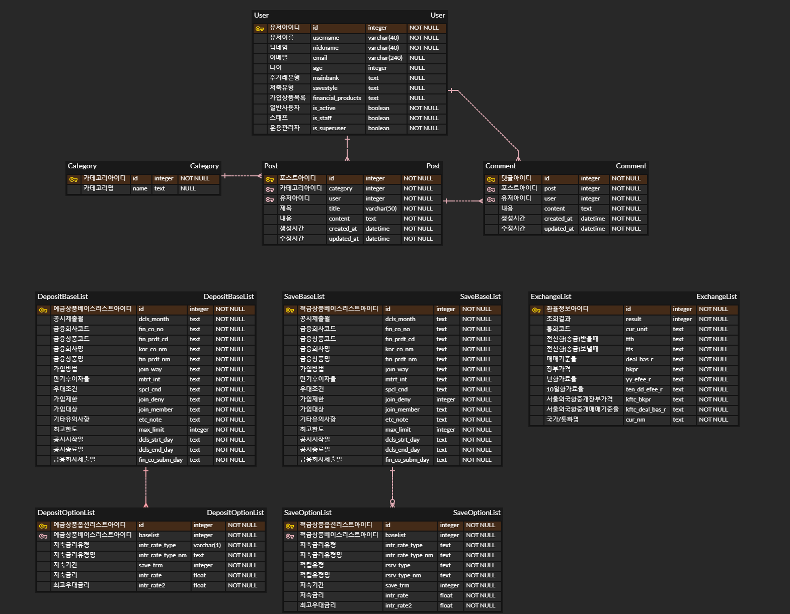

# 금융 상품 비교 및 추천 애플리케이션 개발 pjt
SSAFY 1학기 최종 관통 프로젝트

## 프로젝트 개요
- 프로젝트명: 금융 상품 비교 및 추천 애플리케이션 개발
- 팀원: 강대수, 박이완
- 시작 일시: 2023.11.16.(목)
- 완료 일시: 2023.11.23.(목)
- 기술 스택: `Python`, `Django`, `Vue`

## 프로젝트 컨셉 및 주요 기능
### 프로젝트 컨셉
수많은 예금 적금 관련 금융 상품을 한데 모아 비교하고 분석을 용이하게 하며, 주 거래은행과 예치 기간을 설정함을 통해 금융 상품을 추천받는 서비스 제공

환율 정보 검색과 주변 은행찾기 및 간단한 커뮤니티 서비스 추가 제공

### 주요 기능
- 예금 적금 금융 상품 리스트 조회 및 상세 내용 조회 기능
- 나라별 한국과의 환전 환율 검색 기능
- 지도 API를 이용하여 주변 은행 위치 찾기 기능
- 게시판 형식의 커뮤니티 기능
- 주 거래은행과 예치 기간 정보를 통해 금융 상품 추천 기능
- 가입한 금융 상품별 최고 우대 금리 비교 차트 기능

### ERD

### Component

### 일정
|일정|계획|담당자|상태|
|---|---|---|---|
|2023-11-16|ERD 설계 및 Compoenet 설계|강대수, 박이완|완료|
|2023-11-17|Back: DB설계, 게시판 url, 회원가입 url, 로그인 url 작성, 게시판(카테고리, 게시판, 댓글) view 작성  / Front: Component 구조도의 component 스켈레톤 코드 작성, 회원가입 및 로그인 view, component 작성|Back: 박이완 / Front: 강대수|완료|
|2023-11-18|Back: 금융 상품 관련 정보 DB 저장|박이완|완료|
|2023-11-19|Front: kakao map API를 통한 지도 출력 및 근처 은행 보여주기 기능 추가|강대수|완료|
|2023-11-20|Back: 금융 상품 추천 로직 설계, 환전 기능 url 작성, 유저 프로필 url 설계 / Front: 게시판 component, view 작성, 프로필 component, view 작성|Back: 박이완 / Front: 강대수|완료|
|2023-11-21|Back: 권한(사용자 일치 여부 확인 등) 기능 추가 / Front: 환율 component, view 작성, 금융 상품 관련 component, view 작성|Back: 박이완 / Front - 환율: 박이완 / Front - 금융 상품 관련: 강대수|완료|
|2023-11-22|front: 추천 프론트 개발, main Page 구현 / CSS 적용|Front: 박이완 / CSS: 강대수|완료|
|2023-11-23|CSS 적용, ppt제작, 발표 대본 제작|강대수, 박이완|완료|
|2023-11-24|최종 기능 점검 및 발표|강대수, 박이완|완료|